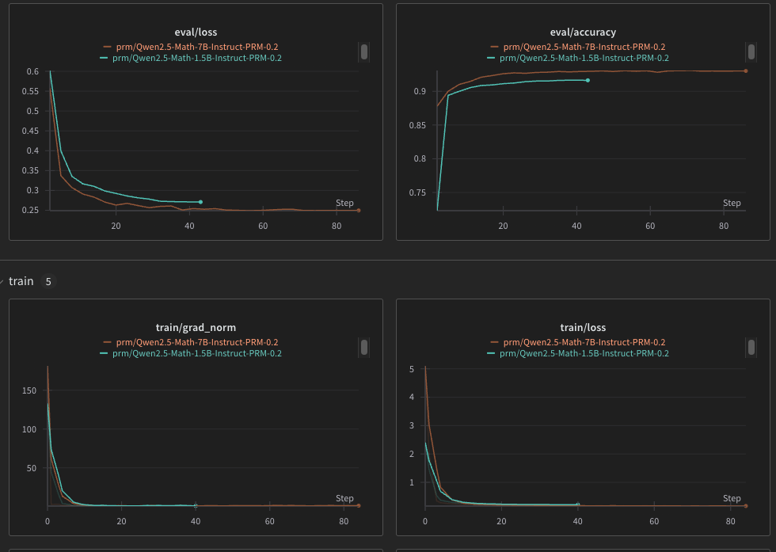

# Training your own PRM

In TRL v0.13.0, the [PRM trainer](https://huggingface.co/docs/trl/v0.13.0/en/prm_trainer) was introduced, simplifying the process of training your own PRM models. This section shows how to fine-tune your own models using TRL, and running the [ProcessBench](https://arxiv.org/abs/2412.06559) benchmark.

## Fine-tuning with TRL

Using `uv` (`pip` or any other package installer should work similar), clone the [TRL](https://github.com/huggingface/trl) repository, create a virtual environment and install the dependencies:

```bash
git clone https://github.com/huggingface/trl.git
cd trl
uv venv .venv --python 3.12
source .venv/bin/activate
uv pip install .
```

And you can navigate to the folders under `/training`. Two folders can be found containing a fine tune of [Qwen/Qwen2.5-Math-1.5B-Instruct](...) on [plaguss/prm800k-trl-dedup](...), and [Qwen/Qwen2.5-Math-7B-Instruct](...). The trainings were run in a slurm cluster with 8xH100, but they can be adapted to the number of available GPUs and resources:

| Model | Training Script |
| :--- | :--- |
| Qwen/Qwen2.5-Math-1.5B-Instruct | [Script](Qwen2.5-Math-1.5B-Instruct-PRM/prm_qwen_math_1p5b_instruct.sh) / [Slurm](Qwen2.5-Math-1.5B-Instruct-PRM/prm_qwen_math_1p5b_instruct.slurm)|
| Qwen/Qwen2.5-Math-7B-Instruct | [Script](Qwen2.5-Math-1.5B-Instruct-PRM/prm_qwen_math_7b_instruct.sh) / [Slurm](Qwen2.5-Math-1.5B-Instruct-PRM/prm_qwen_math_7b_instruct.slurm)|

<details>
<summary>Click for a sample WandB run.</summary>

The figure contains the weights and biases loss curves for the previous models:



</details>

### Models

The following two models were fine tuned using the scripts, examples of use can be found in the corresponding repository:

- [plaguss/Qwen2.5-Math-7B-Instruct-PRM-0.2](https://huggingface.co/plaguss/Qwen2.5-Math-7B-Instruct-PRM-0.2)

- [plaguss/Qwen2.5-Math-1.5B-Instruct-PRM-0.2](https://huggingface.co/plaguss/Qwen2.5-Math-1.5B-Instruct-PRM-0.2)

## Benchmarking with ProcessBench

Using `uv` (`pip` or any other package installer should work similar), clone the [ProcessBench](https://github.com/huggingface/ProcessBench) fork that includes the script to evaluate TRL models, create a virtual environment, and install the requirements:

```bash
git clone https://github.com/huggingface/ProcessBench.git
uv venv .venv --python 3.12
source .venv/bin/activate
uv pip install -r requirements-trl.txt
```

All the experiments were run in 1xH100, the batch size should be adjusted to your capacity (for reference, a batch size of 256 for Qwen2.5-Math-1.5B-Instruct took near 0.5h, and a batch size of 128 for Qwen2.5-Math-7B-Instruct near 2h). Navigate to the `/code` folder, and run the `run_eval_prm_trl.py` script:

```bash
cd code/

python run_eval_prm_trl.py \
    --model_name "plaguss/Qwen2.5-Math-1.5B-Instruct-PRM-0.2" \  # Model to evaluate
    --output_dir "./outputs" \  # Directory to save the results
    --batch_size 256 \  # Batch size
    --sep "\n\n"  # Separator, MUST be the same used during training
```

Click the following buttons to see the example runs and results for the models:

<details>
<summary>plaguss/Qwen2.5-Math-1.5B-Instruct-PRM-0.2</summary>

```bash
python run_eval_prm_trl.py \
    --config "all" \
    --model_name "plaguss/Qwen2.5-Math-1.5B-Instruct-PRM-0.2" \
    --output_dir "./outputs" \
    --batch_size 256 \
    --sep "\n\n"
```

A report like the following will appear in the console:

```bash
Individual Results:
----------------------------------------------------------------------
gsm8k         -> Precision: 22.71  Recall: 93.78  F1 Score: 36.56
math          -> Precision: 38.22  Recall: 70.69  F1 Score: 49.61
olympiadbench -> Precision: 27.08  Recall: 53.98  F1 Score: 36.07
omnimath      -> Precision: 27.93  Recall: 54.77  F1 Score: 37.00
Weighted Averages:
----------------------------------------------------------------------
Weighted      -> Precision: 30.09  Recall: 63.81  F1 Score: 40.38
```

</details>


<details>
<summary>plaguss/Qwen2.5-Math-7B-Instruct-PRM-0.2</summary>

```bash
python run_eval_prm_trl.py \
    --config "all" \
    --model_name "plaguss/Qwen2.5-Math-7B-Instruct-PRM-0.2" \
    --output_dir "./outputs" \
    --batch_size 128 \
    --sep "\n\n"

```

A report like the following will appear in the console:

```bash
Individual Results:
----------------------------------------------------------------------
gsm8k         -> Precision: 62.32  Recall: 81.87  F1 Score: 70.77
math          -> Precision: 58.42  Recall: 67.49  F1 Score: 62.63
olympiadbench -> Precision: 47.35  Recall: 46.90  F1 Score: 47.13
omnimath      -> Precision: 46.38  Recall: 49.79  F1 Score: 48.02
Weighted Averages:
----------------------------------------------------------------------
Weighted      -> Precision: 52.08  Recall: 57.92  F1 Score: 54.73
```
</details>
